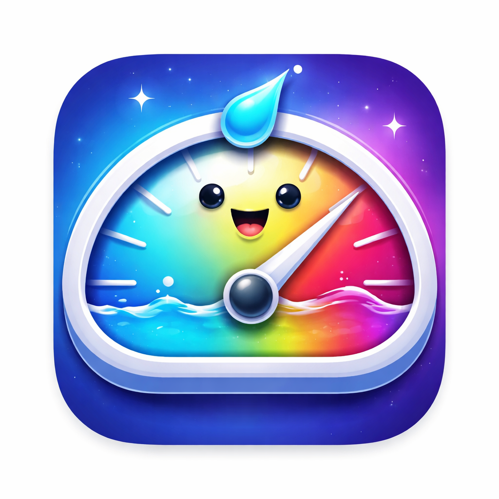

<p align="center">
  
</p>

<h1 align="center">LiquidSpeedBar</h1>

<p align="center">
  A lightweight macOS menu bar utility for live network speed monitoring.
</p>

## Overview

LiquidSpeedBar shows live download and upload speeds directly in the menu bar, with a compact activity graph and connection health score.

The app also includes mood emojis in the UI to reflect current connection quality.

## Features

- Live upload and download speed in the menu bar
- Compact activity graph for traffic trend visualization
- Health score with bottleneck and stability insight
- Diagnostics snapshot copy action
- Buy Me a Coffee button in the popover
- Custom app icon generated from `source/liquidspeedbar.png`

## Run Locally

```bash
swift run
```

## Build

```bash
swift build
```

## Distribution (3 Options)

### 1. DMG Download (.app inside)

Create distributable artifacts:

```bash
scripts/package-macos.sh
```

Generated outputs:

- `dist/LiquidSpeedBar.app`
- `dist/LiquidSpeedBar-macOS-<version>.dmg`
- `dist/LiquidSpeedBar-macOS-<version>.app.tar.gz`

### 2. Terminal Install

Users can install with a single command:

```bash
curl -fsSL https://raw.githubusercontent.com/999Gabriel/LiquidSpeedBar/main/scripts/install.sh | bash
```

Installer behavior:

- Uses latest `.app.tar.gz` release asset when available
- Falls back to source build if no release asset exists

Installs to `/Applications/LiquidSpeedBar.app`.

### 3. Mac App Store Submission

Generate archive/export package:

```bash
DEVELOPER_TEAM_ID=YOURTEAMID scripts/archive-appstore.sh
```

Output path:

- `dist/appstore/export`

## Release Automation

Tag and push to publish release assets through GitHub Actions:

```bash
git tag v1.0.1
git push origin v1.0.1
```

Workflow file:

- `.github/workflows/release-macos.yml`

Manual run for an existing tag:

```bash
gh workflow run release-macos.yml --repo 999Gabriel/LiquidSpeedBar --ref v1.0.1
```

## App Store Checklist

- Create app in App Store Connect
- Match bundle ID with `PRODUCT_BUNDLE_IDENTIFIER`
- Configure signing certificates and team in Xcode
- Run `scripts/archive-appstore.sh`
- Upload exported package with Transporter
- Submit for review

## Support

Buy Me a Coffee:

- https://buymeacoffee.com/the999gabriel
